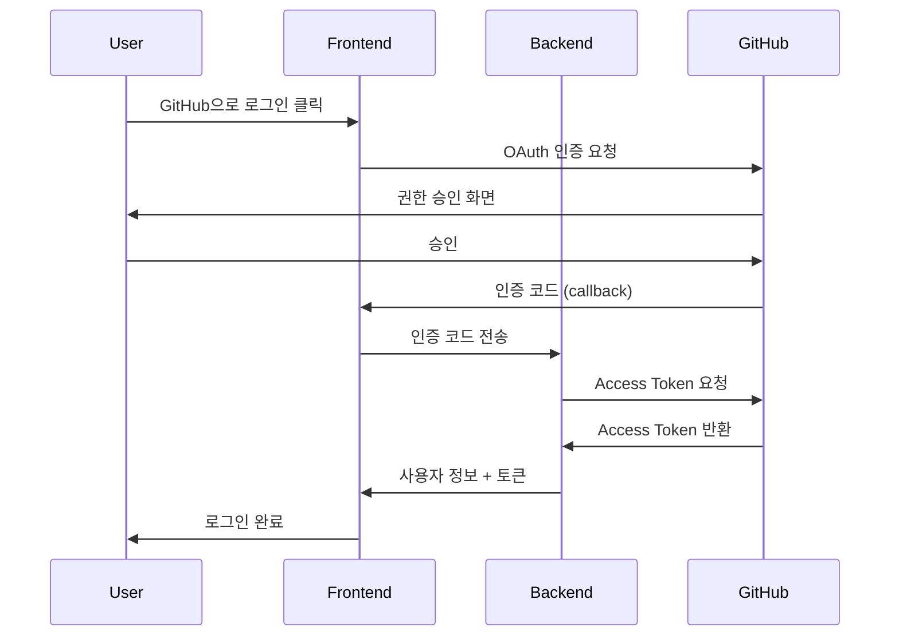

# 🚀 Auto Documentation

> **GitHub 저장소의 변경사항을 AI로 자동 문서화하는 서비스**

Auto Documentation은 GitHub 저장소와 연동하여 코드 변경사항을 실시간으로 감지하고, AI를 활용해 자동으로 문서를 생성하는 웹 애플리케이션입니다.


---

## 📖 서비스 소개

### 왜 Auto Documentation인가?

개발 과정에서 **문서화 작업**은 종종 뒷전으로 밀리거나 누락되기 쉽습니다. Auto Documentation은 이러한 문제를 해결하기 위해 탄생했습니다.

### 핵심 가치

- **🤖 AI 기반 자동화**: 코드 변경사항을 분석하여 자동으로 문서를 생성합니다
- **⚡ 실시간 동기화**: GitHub 웹훅을 통해 커밋 발생 시 즉시 문서화가 시작됩니다
- **✏️ 유연한 편집**: AI가 생성한 문서를 직접 수정하고 개선할 수 있습니다
- **📤 GitHub 발행**: 생성된 문서를 바로 저장소의 README로 발행할 수 있습니다

---

## ✨ 주요 기능

### 1. GitHub 연동

- **GitHub OAuth 로그인**: 안전한 OAuth 2.0 인증으로 GitHub 계정과 연동
- **저장소 자동 조회**: 연결된 계정의 모든 저장소 목록을 자동으로 가져옴
- **권한 관리**: 저장소별 웹훅 설정 및 관리 가능

### 2. 웹훅 기반 자동 문서화

- **원클릭 웹훅 설정**: 저장소에 웹훅을 쉽게 등록
- **이벤트 감지**: Push, Pull Request 등 다양한 이벤트 감지
- **자동 트리거**: 코드 변경 시 백엔드 AI가 자동으로 문서 생성

### 3. 문서 관리

- **문서 목록 조회**: 저장소별 생성된 모든 문서 확인
- **상세 뷰어**: Markdown 렌더링, 코드 하이라이팅, Mermaid 다이어그램 지원
- **Diff 비교**: 이전 버전과의 변경 사항 시각적 비교
- **인라인 편집**: 에디터에서 직접 문서 내용 수정

### 4. 문서 발행

- **GitHub README 발행**: 생성된 문서를 저장소의 README.md로 직접 커밋
- **커밋 메시지 커스터마이징**: 발행 시 원하는 커밋 메시지 지정 가능

---

## 🛠️ 기술 스택

### Frontend

| 기술 | 버전 | 설명 |
|------|------|------|
| **Next.js** | 16.0.0 | React 기반 풀스택 프레임워크 |
| **React** | 19.2.0 | UI 라이브러리 |
| **TypeScript** | 5.x | 정적 타입 지원 |
| **TailwindCSS** | 4.0 | 유틸리티 기반 CSS 프레임워크 |
| **TanStack Query** | 5.x | 서버 상태 관리 |
| **Axios** | 1.x | HTTP 클라이언트 |

### UI 컴포넌트

| 기술 | 설명 |
|------|------|
| **Radix UI** | 접근성이 뛰어난 헤드리스 UI 컴포넌트 |
| **Lucide Icons** | 아이콘 라이브러리 |
| **react-markdown** | Markdown 렌더링 |
| **react-diff-view** | Diff 뷰어 |
| **mermaid** | 다이어그램 렌더링 |

---

## 📂 프로젝트 구조

```
src/
├── api/                      # API 관련 모듈
│   ├── client.ts             # Axios 클라이언트 설정
│   ├── types.ts              # TypeScript 타입 정의
│   ├── index.ts              # API 통합 export
│   └── endpoints/            # API 엔드포인트
│       ├── auth.ts           # 인증 API
│       ├── repositories.ts   # 저장소 API
│       ├── webhooks.ts       # 웹훅 API
│       └── documents.ts      # 문서 API
├── app/                      # Next.js App Router
│   ├── page.tsx              # 메인 페이지
│   ├── layout.tsx            # 루트 레이아웃
│   ├── globals.css           # 전역 스타일
│   ├── documents/            # 문서 페이지
│   └── github/               # GitHub OAuth 콜백
├── components/               # React 컴포넌트
│   ├── repository-list.tsx   # 저장소 목록
│   ├── repository-card.tsx   # 저장소 카드
│   ├── document-viewer.tsx   # 문서 뷰어
│   ├── diff-viewer.tsx       # Diff 뷰어
│   ├── readme-viewer.tsx     # README 뷰어
│   └── ui/                   # 공통 UI 컴포넌트
├── hooks/                    # Custom React Hooks
│   ├── useAuth.ts            # 인증 상태 관리
│   ├── useRepositories.ts    # 저장소 데이터 관리
│   ├── useWebhooks.ts        # 웹훅 데이터 관리
│   └── useDocument.ts        # 문서 데이터 관리
├── lib/                      # 유틸리티
└── providers/                # Context Providers
```

---

## 🚀 시작하기

### 1. 환경 요구사항

- Node.js 18.x 이상
- npm, yarn, pnpm 또는 bun

### 2. 설치

```bash
# 저장소 클론
git clone https://github.com/your-repo/auto-documentation-fe.git
cd auto-documentation-fe

# 의존성 설치
npm install
# 또는
yarn install
# 또는
pnpm install
```

### 3. 환경 변수 설정

`.env.local` 파일을 생성하고 다음 변수를 설정하세요:

```env
# 백엔드 API URL
NEXT_PUBLIC_API_URL=http://localhost:8000

# 프로덕션 환경
# NEXT_PUBLIC_API_URL=http://15.165.120.222
```

### 4. 개발 서버 실행

```bash
npm run dev
# 또는
yarn dev
# 또는
pnpm dev
```

[http://localhost:3000](http://localhost:3000)에서 애플리케이션을 확인하세요.

---

## 📡 API 연동

### 주요 API 엔드포인트

| 엔드포인트 | 메서드 | 설명 |
|------------|--------|------|
| `/github/auth/login` | GET | GitHub OAuth 로그인 |
| `/github/auth/callback` | GET | OAuth 콜백 처리 |
| `/github/repositories/{user_id}` | GET | 저장소 목록 조회 |
| `/github/setup-repository/{user_id}` | POST | 웹훅 설정 |
| `/github/webhooks/{owner}/{repo}/{user_id}` | GET | 웹훅 목록 조회 |
| `/documents/{user_id}` | GET | 문서 목록 조회 |
| `/documents/{doc_id}` | GET | 문서 상세 조회 |
| `/documents/{doc_id}` | PUT | 문서 수정 |
| `/documents/{doc_id}/publish` | POST | GitHub README 발행 |

자세한 API 사용법은 [API_GUIDE.md](./API_GUIDE.md)를 참고하세요.

---

## 🔐 인증 흐름



---

## 📄 문서 상태

| 상태 | 설명 |
|------|------|
| `generated` | AI가 자동으로 생성한 문서 |
| `edited` | 사용자가 직접 수정한 문서 |
| `reviewed` | 검토가 완료된 문서 |
| `failed` | 생성에 실패한 문서 |

---

## 🤝 기여하기

1. Fork the repository
2. Create your feature branch (`git checkout -b feature/amazing-feature`)
3. Commit your changes (`git commit -m 'Add some amazing feature'`)
4. Push to the branch (`git push origin feature/amazing-feature`)
5. Open a Pull Request

---

## 📝 라이선스

이 프로젝트는 MIT 라이선스 하에 배포됩니다.

---

## 📞 문의

프로젝트에 대한 문의사항이 있으시면 이슈를 등록해주세요.
